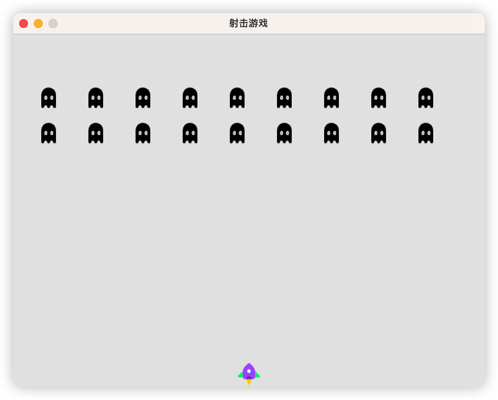

# shooting-game

一款使用 Ebiten 开发的简易射击游戏

- ebiten：ebiten 引擎的一些基础用法
- images：游戏中用到的一些图片
- bullet：子弹
- config：游戏配置
- game：游戏主逻辑
- monster：怪物👹
- main：启动

## TODO

1. [x] 新增飞船
2. [x] 新增怪物
3. [x] 新增子弹 
4. [x] 当前屏幕中只允许出现固定数量的子弹，超出不允许再射击 
5. [x] 新增子弹击打怪物逻辑
6. [x] 新增游戏开始/结束界面
7. [x] 新增判断游戏胜负逻辑
8. [ ] 新增记分板

